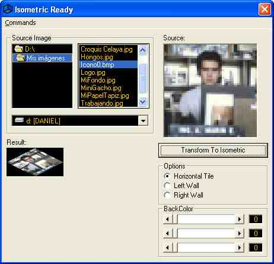



## Isometric Tile Converter

### Description

This code transforms planar images to isometric tiles and walls, if you want to make an isometric tile game this could be a good utility
 
### More Info
 
Any question or comment see the README1ST.TXT file

             |
---                |---
**Submitted On**   |2002-10-21 19:25:50
**By**             |[Gacho Man](https://github.com/Planet-Source-Code/PSCIndex/blob/master/ByAuthor/gacho-man.md)
**Level**          |Intermediate
**User Rating**    |4.8 (24 globes from 5 users)
**Compatibility**  |VB 6\.0
**Category**       |[Graphics](https://github.com/Planet-Source-Code/PSCIndex/blob/master/ByCategory/graphics__1-46.md)
**World**          |[Visual Basic](https://github.com/Planet-Source-Code/PSCIndex/blob/master/ByWorld/visual-basic.md)
**Archive File**   |[Isometric\_14851110212002\.zip](https://github.com/Planet-Source-Code/gacho-man-isometric-tile-converter__1-40034/archive/master.zip)

